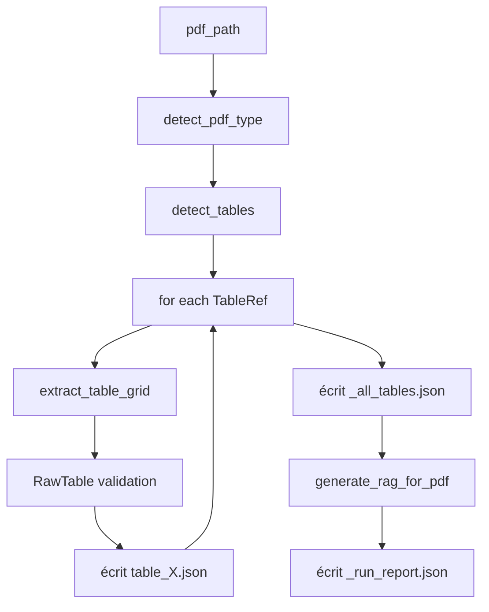
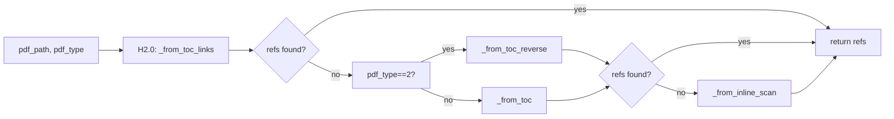

# 🏗️ Architecture — STM32 Datasheet Extractor → RAG

**Repository:** `st_datasheets153`  
**Corpus:** 185 STM32 datasheets, 20 familles (169 Type 1 / 16 Type 2)

---

## 0. Flux de bout en bout

```
DataSHEET/<family>/<pdf>.pdf
        │
        ▼  main.py  (CLI: --pdf │ --family │ --all)
┌──────────────────────────────────────────────────────────────┐
│  ÉTAPE 0 — Features page 1    page1_features.py              │
│      → features.json  (core, flash, timers, packages, ...)   │
│      ↓ (indépendant, ne bloque pas l'extraction)             │
│                                                                │
│  ÉTAPE 1 — Détection           toc_detector.py                 │
│      → list[TableRef]  (table_id, caption, page)              │
│                                                                │
│  ÉTAPE 2 — Extraction           grid_extractor.py              │
│      → extract_table_grid() → dict RawTable                    │
│      + find_continuations()   continuation.py  (multi-pages)   │
│      + fix_headers/fix_rows    glyph_fixer.py  (µ Ω ° ² ³)     │
│      + evaluate_table()        quality_flags.py (confiance)    │
│      → Validation Pydantic RawTable   schema.py                │
└──────────────────────────────────────────────────────────────┘
        │
        ▼  écrit 1 JSON/table + _all_tables.json + _run_report.json
   outJason/<family>/<pdf_name>/...
        │
        ▼  generate_rag_for_pdf()  rag_transformer.py  (auto dans main.py)
   RagJason/<family>/<pdf_name>.json   ← array de {id, document, metadata}
        │
        ▼  monitoring (optionnel)
   global_extraction_stats.json  (aggregate_stats.py)
```

---

## 1. Types de PDF

Le système distingue deux types de PDF qui déterminent toute la logique en aval :

| | Type 1 — Acrobat | Type 2 — Antenna House |
|---|---|---|
| **TOC** | début du PDF | fin du PDF (30 dernières pages) |
| **Bandeau** | non | bandeau marginal en haut de page |
| **Détection** | `pdfinfo` sans "antenna" | `pdfinfo` contient "antenna" |
| **Settings pdfplumber** | `edge_min_length=3` | `edge_min_length=5` (tolérant) |
| **Propagation** | bbox standard | `_propagate_spans_type2()` |
| **Zero-empty** | non (hérité) | `_ensure_no_empty_cells()` (Fix 8) |

```python
# main.py:43-52
def detect_pdf_type(pdf_path: str) -> int:
    info = subprocess.run(["pdfinfo", pdf_path], ...).stdout.lower()
    return 2 if "antenna" in info else 1
```

---

## 2. Point d'entrée CLI — `main.py`

### Usage
```bash
# Un seul PDF
python table_extractor_raw/main.py --pdf DataSHEET/H7/stm32h7a3ag.pdf
# Toute une famille
python table_extractor_raw/main.py --family C0
# Tous les PDFs du projet
python table_extractor_raw/main.py --all
```

### Processus interne — `process_pdf(pdf_path, family)` (`main.py:67-216`)



1. `pdf_name = pdf_path.stem`
2. `pdf_type = detect_pdf_type(str(pdf_path))` (`:99`)
3. **Étape 1** : `detect_tables(str(pdf_path), pdf_type=pdf_type)` (`:104`)
4. **Étape 2** : boucle sur chaque `TableRef` → `extract_table_grid(...)` (`:122`)
5. Validation : `RawTable(**raw_dict)` → `table_obj.model_dump()` (`:133-134`)
6. Ajout `datasheet_metaData` (`:137-146`)
7. Écriture `out_dir / f"{ref.table_id}.json"` + append `all_tables_json` (`:149-153`)
8. Écriture `_all_tables.json` (`:176-180`)
9. **RAG** : `generate_rag_for_pdf(all_tables_json, family, pdf_name, REPO_ROOT/"RagJason")` (`:182-190`)
10. Écriture `_run_report.json` avec top-5 `worst_tables` (`:210-214`)

---

## 3. Étape 0 — Features page 1 (`page1_features.py`)

### Objectif

Extraire automatiquement les caractéristiques techniques de la page de
garde de chaque datasheet : cœur, fréquence, flash, SRAM, tension,
température, packages, part numbers, timers, ADC, DMA, interfaces de
communication et sécurité.

**Indépendant** du pipeline d'extraction des tables : si cette étape
échoue, les tables sont tout de même extraites.

### `_parse_header_footer()` — `page1_features.py:176-204`

Extrait le titre, la référence document (`DS13866`), la révision
(`Rev 5`) et la date (`February 2026`) depuis le pied de page du PDF.

- Type 1 : `TYPE1_FOOTER_RE` = `"February 2026  DS13866  Rev 5  1/1"`
- Type 2 : `TYPE2_FOOTER_RE` = `"DS14581 - Rev 2 - March 2024"`
- Titre : première ligne substantielle ne correspondant pas aux motifs
  de bruit (`Datasheet`, `DS`, `Rev`, puces, etc.)

### `_parse_packages()` — `page1_features.py:207-224`

Extrait les noms de packages (`SO8N`, `TSSOP20`, `UFQFPN20`, ...) et
leurs dimensions associées. Les dimensions sont souvent sur une ligne
différente dans le texte pdfplumber — le parser les associe par position
pour produire `"SO8N (4.9×6 mm)"`.

### `_parse_device_summary()` — `page1_features.py:235-330`

Extrait la table **Device summary** (Reference / Part number) depuis la
page 1 du PDF.

**Type 1 (Acrobat)** : cherche la table dont les headers contiennent
`"Reference"` et `"Part number"`. Retourne un dict `{headers, rows}`.

**Type 2 (Antenna House)** : detecte le bandeau header `"Product summary"`
ou `"Device summary"` et appelle `_parse_device_summary_type2()`.
Nettoyage des artefacts "S" du bandeau bleu + correction préfixe STM32.

**Fallback** : regex `PART_RE` = `r'STM32[A-Z0-9]{6,}'` sur tout le texte.

**Pourquoi cette approche ?** La regex brute capture des faux positifs
(ex: `STM32` dans un bloc de texte générique). La grille pdfplumber garantit
que seuls les vrais part numbers de la colonne "Part number" sont extraits.

### `_parse_features_bullets()` — `page1_features.py:278-327`

Analyse le texte de la page 1 par recherche plein texte :

| Champ | Regex | Exemple match |
|-------|-------|---------------|
| `core` | `Cortex[®\\s]*-(Cortex-M0+)` | `Cortex®-M0+` |
| `fpu` | `with FPU\|floating point unit` | `with FPU` |
| `max_frequency_mhz` | `(?:frequency up to\|up to) (\d+) MHz` | `frequency up to 48 MHz` |
| `flash_kb` | `(\d+(?:\.\d+)?) -? (K\|M)bytes .*? flash` | `64-Kbyte flash` (prend le max si plusieurs) |
| `ram_kb` | `(\d+(?:\.\d+)?) -? (K\|M)bytes .*? SRAM` | `12-Kbyte SRAM` |
| `voltage` | `(\d+\.?\d*) V (?:to\|-) (\d+\.?\d*) V` | `2.0 V to 3.6 V` |
| `temperature` | `(-?\d+) °C?\s*to\s*(-?\d+)°C?` + compounds | `-40°C to 85°C/105°C/125°C` ou `-40 °C to 85/125 °C` |
| `coremark` | `(\d+\.?\d*) CoreMark` | `134 CoreMark` |

Les champs `communication_interfaces`, `adc`, `timers`, `dma_channels`,
`security` ont été retirés du modèle `DeviceFeatures` car leurs données
étaient trop bruitées (lignes mélangées avec d'autres puces).

### Gestion des formats Type 1 / Type 2

Les deux types de PDF ont des différences de formatage sur la page 1 :

| Aspect | Type 1 (Acrobat) | Type 2 (Antenna House) |
|--------|------------------|------------------------|
| Puces | `•` | `•` (identique) |
| Température | `-40°C to 85°C/105°C/125°C` | `-40 °C to 85/125 °C` (espaces, °C optionnel) |
| Packages | `SO8N (4.9×6 mm)` sur 2 lignes | `TSSOP20 (6.4 x 4.4 mm)` sur 1 ligne |
| Timer line | `• 8 timers: 16-bit...` | `9 timers, RTC, and 2 watchdogs` (sans puce) |
| Comm. interfaces | `• One I2C-bus interface` | `• 3x I2C interfaces supporting Fast-mode` |

### Sortie — `features.json`

```json
{
  "pdf_name": "stm32c011d6",
  "family": "C0",
  "core": "Cortex-M0+",
  "max_frequency_mhz": 48,
  "flash_kb": 32,
  "ram_kb": 6,
  "voltage_min_v": 2.0,
  "voltage_max_v": 3.6,
  "operating_temp_c": ["-40°C to 85°C", "-40°C to 105°C", "-40°C to 125°C"],
  "packages": ["SO8N (4.9×6 mm)", "WLCSP12 (1.70×1.42 mm)", "TSSOP20 (6.4×4.4 mm)", "UFQFPN20 (3×3 mm)"],
  "device_summary": {
    "headers": ["Reference", "Part number"],
    "rows": [
      ["STM32C011x4",  "STM32C011F4, STM32C011J4"],
      ["STM32C011x6",  "STM32C011F6, STM32C011J6, STM32C011D6"]
    ]
  },
  "extraction_meta": {
    "source_pages": [1],
    "extraction_method": "regex_type1",
    "confidence": "high",
    "missing_fields": ["coremark"]
  }
}
```

---

## 4. Étape 1 — Détection (`toc_detector.py`)

### `TableRef` — `toc_detector.py:40-45`
```python
@dataclass
class TableRef:
    table_id: str      # "table_12"
    caption:  str      # "Table 12. I2C characteristics"
    page:     int      # 1-indexed
```

### Dispatch — `detect_tables(pdf_path, pdf_type)` (`toc_detector.py:121-143`)


| Fonction | Type | Comportement |
|---|---|---|
| `_from_toc_links(pdf_path, pdf, pdf_type)` (`:206`) | **H2.0** | Utilise les annotations PDF `/Link → /GoTo` de la List of Tables pour détecter les tables avec une précision geometrique |
| `_find_lot_pages(pdf, pdf_type)` (`:152`) | Helper | Détecte TOUTES les pages de la List of Tables (pas seulement la 1ère), avec fallback bidirectionnel |
| `_from_toc(pdf, start_from)` (`:288`) | Type 1 | TOC début ; detection d'en-tête "List of Tables" ; machine à états pending_num/pending_caption ; `MAX_TOC_PAGES=10` ; dédup |
| `_from_toc_reverse(pdf)` (`:277`) | Type 2 | `start_page = max(1, total-30)` puis `_from_toc` ; fallback sur scan complet |
| `_from_inline_scan(pdf)` (`:293`) | Fallback | Itère toutes les pages ; match `INLINE_CAPTION_PATTERN` ; tri par `(page, table_id)` |
| `_clean_caption(text)` (`:113`) | Helper | Supprime les points de remplissage du TOC (`. . . . .`) et le numéro de page en fin de caption |

**Nouveau H2.0** : Extrait les tables via les annotations PDF natives (`/Link` avec `/Dest` GoTo). Résout les destinations via `pypdf` (mapping `objid → page_index`). Nettoie les captions des points de remplissage et des numéros de page en fin. Fallback automatique vers H2.1-H2.4 si 0 table trouvée.

**Recherche multi-pages LOT** : `_find_lot_pages` cherche toutes les pages de la List of Tables (les datasheets récentes peuvent avoir 2-4 pages de TOC). Direction automatique : début pour Type 1, fin pour Type 2, avec fallbidirectionnel si la première direction échoue.

**Détails de `_from_toc` :**
- Repère en-tête de TOC via `TOC_SECTION_PATTERNS`
- Parse entrées via `TOC_ENTRY_PATTERN` : `"Table 12. I2C characteristics .... 78"`
- Détecte la sortie du TOC en repérant des lignes hors format TOC

---

## 4. Étape 2 — Extraction (`grid_extractor.py`)

### `extract_table_grid(...)` — `grid_extractor.py:752-932`

Ordre d'appel interne (les "Fix") :

| # | Nom | Fonction | Ligne | Rôle |
|---|---|---|---|---|---|
| 1 | Fix 1 | `_get_rotated_text_map()` | `:789` | Texte vertical inversé → upright |
| 2 | — | `_extract_from_page()` | `:792` | 3 tentatives : lignes → texte → sans finder |
| 3 | Fix 2 & 5 | `_expand_spans_and_headers()` | `:806` | Headers multi-niveaux, fusions, colonnes fantômes |
| 4 | **—** | **Fill-down** | **`:811`** | **Propagation verticale des cellules vides depuis le header** |
| 5 | — | `find_continuations()` | `:814` | Détection et fusion multi-pages |
| 6 | Fix 7 | Boucle surplus x0 | `:833-859` | Insertion colonnes split (géométrie x0) |
| 7 | Fix 8 | `_fill_horizontal()` | `:861-868` | Remplissage horizontal Type 2 |
| 8 | Fix 6 | Boucle `rows_raw` | `:877-895` | Propagation verticale avec détection de groupe |
| 9 | Fix 8 | `_ensure_no_empty_cells()` | `:901` | Zéro cellule vide (horizontal → vertical → boucle) |
| 10 | — | `fix_headers()` / `fix_rows()` | `:905-906` | Glyphes, None→"" |
| 11 | — | **Caption row filter** | **`:909-919`** | **Filtrage des lignes au-dessus de la légende (toutes méthodes)** |
| 12 | — | `evaluate_table()` | `:909` | Confidence + warnings |
| 13 | — | Assemblage dict final | `:913-920` | headers, rows, merged_pages, confidence... |
| 14 | — | `_save_debug_image()` | `:923-925` | PNG debug (si SAVE_DEBUG_IMAGES) |
| 15 | Fix 9 | `_remove_trailing_footnotes()` | `:1846` | Supprime les lignes de footnotes `"1."`, `"2."` en fin de tableau |
| 16 | Fix 10 | `_merge_fragmented_columns()` | `:1566` | Fusionne les colonnes fragmentées (pdfplumber_text) : heuristiques minuscule, concat avec espace intelligent, guard duplication, détection header leak |
| 17 | Fix 11 | `_merge_empty_header_rightward()` | `:1866` | Fusionne les colonnes à header vide vers la droite (bridge columns), guard `val != target` |
| 18 | Fix 12 | Caption bleed row removal | `:1033` | Suppression 1ère ligne si `"Table N."` match table_id (continuation) |
| 19 | Fix 13 | `extract_ordering_info()` | `:890` | Parsing texte pages "Ordering information" → structured_json |
| 20 | Fix 14 | Header residual cleanup | `:1204` | Suppression lignes header dupliquées dans rows_fixed (footnotes) |
| 21 | Fix 15 | body_on_next_page column check | `:1009` | Rejet si `nxt_cols > orig_col_count * 2 + 5` (TOC misdetection) |
| 22 | Fix 16 | `result["extraction_method"]` sync | `:1018` | Synchronisation method après body_on_next_page |
| 23 | Fix 17 | Détection header leaks dans `_merge_fragmented_columns()` | `:1662` | Ignore les cellules données identiques à l'en-tête de leur colonne (fragments d'en-tête qui coulent dans les données). Ex: colonne "s" (suffixe de "Conditions") → données "s" ignorées |
| 24 | Fix 18 | Extension `_remove_bleed_rows_bottom()` | `:1481` | Nouvelle heuristique : 1ère cellule non-alphanumérique (`.4 Embe`, `(1)`) → suppression ligne parasite |
| 25 | Fix 19 | Filtre footnote `(N)` post-merge | `:1319` | Supprime toute ligne dont la 1ère cellule est exactement `(1)`, `(2)`, etc. (notes de bas de tableau non capturées par les autres filtres) |
| 26 | Fix 20 | `_apply_rotated_fix()` + `_fix_reversed_cells()` | `:1876` + `:1411` | Correction robuste du texte inversé dans cellules fusionnées verticales. Matching `re.sub(r'[^a-zA-Z0-9]', '', ...)` + `startswith()` pour gérer abréviations (`Comm.interfaces` vs `Communicationinterfaces`). Post-processing basé sur `1er_caractère_minuscule && dernier_majuscule`. |

### `_extract_from_page()` — `grid_extractor.py:950-995`

3 tentatives de plus en plus permissives :

```python
# Tentative 1 — Lignes (settings standard)
best, best_ft, method = page.extract_tables(settings) + debug_tablefinder
# Tentative 2 — Texte fallback (settings souples)
best, best_ft, method = page.extract_tables(fallback_settings) + debug_tablefinder
# Tentative 3 — Sans finder (bbox = page entière)
best, best_ft, method = page.extract_tables(), dummy_ft
# Échec total
return None, None, "pdfplumber", None
```

### `_expand_spans_and_headers()` — `grid_extractor.py:458-706`

Étapes internes :
1. **Géométrie grille** : `col_centers` (médian x des cellules des premières lignes)
2. **Header compressé** : détecte cellule multi-lignes qui couvre ≥2 colonnes, projette sous-labels
3. **Colonnes fantômes** : marque les colonnes absentes de toute ligne physique
4. **Propagation spans** :
   - Type 2 → `_propagate_spans_type2()` (`:301`) : logique spécifique Antenna House
   - Type 1 → propagation BBox + heuristique
5. **Fill-down** : propage la dernière valeur non-vide vers le bas dans chaque colonne (corrige les rivières de `""` dans les cellules rowspan)
6. **Profondeur header** : géométrique + `_count_header_rows_by_color()` (Type 2, detecte bleu foncé RGB)
7. **Headers finaux** : `_build_final_headers()` (`:692`) joint parents/enfants avec `" / "`

### `_find_caption_y()` — `grid_extractor.py:124-157`

Localise la légende d'une table sur la page en cherchant une séquence de mots consécutifs. Ignore la ponctuation ET les notes de bas de page entre parenthèses `(n)` via `split("(")[0]`, permettant de matcher `"TIMx(1)"` avec `"TIMx"`.

### Filtrage des lignes par légende — `grid_extractor.py:900-919`

Après extraction, les lignes situées au-dessus de la légende (capture de figures, diagrammes) sont automatiquement supprimées. Ce filtrage s'applique à **toutes les méthodes d'extraction** (`pdfplumber` et `pdfplumber_text`) via le caption y-position, pas seulement le fallback texte.

### Fix 6 — Propagation verticale (`grid_extractor.py:877-895`)

```python
for r in range(1, len(rows_raw)):
    for c in range(min_cols):
        if rows_raw[r][c] == "":
            # Type 2 : ne pas propager si 1ère colonne = nouveau groupe jamais vu
            if pdf_type == 2 and first_col_changed_to_new_value:
                continue
            rows_raw[r][c] = rows_raw[r-1][c]
```

**Pourquoi Type 2 nécessite un garde :** dans les PDFs Antenna House, les tableaux ont des `rowspan` visuels mais les données changent parfois légitimement de groupe (ex: table_6 "I/O structure" → "Notes"). Sans le garde, la propagation écrase la première occurrence.

### Fix 7 — Insertion split colonnes (`grid_extractor.py:833-859`)

```python
n_insert = target_cols - len(headers)  # target_cols = max(page1, continuation)
if n_insert > 0:
    surplus_x0s = continuation_x0s not_in page1_x0s (tol. 5pt)
    insert_positions = positions géométriques (x0)
    for pos in reversed(insert_positions):
        headers = headers[:pos] + [headers[pos-1]] + headers[pos:]  # répète parent
        rows = [r[:pos] + [""] + r[pos:] for r in rows]
```

**Logique :** quand une page de continuation scinde une colonne (ex: "Name" → "Name" + sous-colonne), les nouveaux x0 apparaissent. Le code insère une colonne vide à la position correspondante dans la page 1, et répète le header du voisin gauche (parent).

**Ce qu'on a corrigé (`d2c9a69`)** : le garde `_is_x0_inside_header_cell` bloquait les x0 qui tombaient dans une cellule header fusionnée (ex: "Name" couvre x0=42→297, sous-colonne à 170). Il a été supprimé car `target_cols = max(...)` gère déjà le max toutes pages.

### Fix 8 — Zéro cellule vide (`grid_extractor.py:243-271`, appelé `:901`)

```python
def _ensure_no_empty_cells(rows):
    while changed:
        _fill_horizontal(rows)     # copie depuis la gauche
        _fill_vertical(rows)       # copie depuis le dessus
        # Si toute une ligne est vide → copier celle du dessus
        # Si 1ère colonne vide → copier la 1ère valeur non-vide de la ligne
```

**Garantie :** **aucune cellule `""`** dans la sortie Type 2. Itère jusqu'à stabilisation.

---

## 5. Continuation (`continuation.py`)

### `_is_continuation_page()` — `continuation.py:50-141`

Détecte si une page N+1 est la suite logique d'une table :

1. **Detection de titre** : texte contient `"table {num}"` ET `"continued"` / `"(suite)"` (`:74-78`)
2. **Extraction table** : prend la **plus haute** de la page (`:103`)
3. **Filtres** :
   - `col_count > expected + 2` → rejette (trop de colonnes)
   - `col_count < max(2, expected - 2)` → rejette (note de bas de page) (`:105-115`)
4. **Sans titre (heuristique)** : `bbox[1] ≤ 300` + pas d'autre caption au-dessus (`:120-134`)

### `find_continuations()` — `continuation.py:221-315`

```python
target_cols = max(expected_col_count, min(max_cont_cols, expected_col_count + 1))
```

- Scanne pages suivantes ; s'arrête avant la table suivante différente (`:245-252`)
- Drop lignes d'en-tête répétées (match `first_cell_text` ou mots-clés) (`:268-293`)
- Ajuste les lignes à `target_cols` via :
  - `_expand_cont_row()` (`:144`) : distribue valeurs réelles également
  - `_reduce_cont_row()` (`:183`) : supprime colonnes les plus vides (recherche combinatoire)

---

## 6. Schéma de données

### `RawTable` (Pydantic `BaseModel`) — `schema.py:10-36`

```python
table_id: str                    # "table_12"
caption: str                     # "Table 12. I2C characteristics"
pdf_name: str                    # "stm32h7a3ag"
family: str                      # "H7"
page: int                        # 1-indexed
merged_pages: list[int]          # [29,30] si multi-page, [29] sinon
headers: list[str]               # ["Symbol", "Parameter", "Min", "Typ", "Max", "Unit"]
rows: list[list[str]]            # [["VDD", "Supply", "1.62", "3.6", "V"], ...]
extraction_method: str           # "pdfplumber" | "pdfplumber_text" | "failed"
extraction_confidence: str       # "high" | "medium" | "low" | "failed"
empty_cell_ratio: float          # 0.0 - 1.0
col_count: int                   # len(headers)
structured_json: Optional[dict]  # Données structurées pages non-grille (ordering info)
warnings: list[str]              # ["vertical_merge_suspected"]
```

### `datasheet_metaData` (ajouté APRES validation, `main.py:137-146`)

```json
{
  "pdf_name": "stm32h7a3ag",
  "table_id": "table_12",
  "is_continued": true,
  "pages": [29, 30],
  "rows_count": 23,
  "cols_count": 10,
  "confidence": "high",
  "empty_cell_ratio": 0.0
}
```

**Non présent dans `RawTable`** — ajouté dynamiquement au dict après `model_dump()`.

---

## 7. Glyphes & Qualité

### `glyph_fixer.py`

**Problème :** les PDFs contiennent des caractères Private Use Unicode (`\uf0b2` = °, `\uf0d8` = ↑) que le JSON ne doit pas transmettre tels quels.

```python
# GLYPH_MAP — glyph_fixer.py:17-44
GLYPH_MAP = {
    "\uf0b2": "°",    # degré
    "\uf0b8": "²",    # exposant 2
    "\uf0b9": "³",    # exposant 3
    "\u03a9": "Ω",    # Ohm
    "\u00b5": "µ",    # micro
    "\uf0d8": "↑",    # flèche haut
    "\uf0da": "↓",    # flèche bas
    ...
}
```

| Fonction | Ligne | Rôle |
|---|---|---|
| `fix_text(text)` | `:58` | Glyph replace → NFC normalize → regex (espaces, newlines) |
| `fix_headers(headers)` | `:83` | Applique `fix_text` sur chaque header + None→"" |
| `fix_rows(rows)` | `:88` | Applique `fix_text` sur chaque cellule + None→"" |

### `quality_flags.py`

`evaluate_table(headers, rows)` → `(confidence, empty_ratio, col_var, warnings)` (`:43`)

| Seuil (`config.py`) | Valeur | Usage |
|---|---|---|
| `MIN_DATA_ROWS` | 1 | En-dessous → `low` |
| `MAX_EMPTY_CELL_RATIO` | 0.50 | Dépassé → `low` |
| `MAX_COL_VARIANCE` | 0.40 | Dépassé → `low` |

**Warnings** (`quality_flags.py:63-86`) :
- `no_headers_detected` : tous les headers sont vides
- `few_data_rows` : `len(rows) < MIN_DATA_ROWS`
- `high_empty_ratio` : `empty_ratio > 0.6 * MAX_EMPTY_CELL_RATIO` (seuil `medium`)
- `inconsistent_col_count` : `col_variance > 0`
- `header_row_ambiguous` : headers trop courts (≤4 chars)
- `vertical_merge_suspected` : lignes avec cellules collées (1 seul token vs 12 colonnes)

---

## 8. Étape RAG (`rag_transformer.py`)

### Catégorisation — `get_category(caption)` (`:52-67`)

| Catégorie | Déclencheur (regex, minuscules) |
|---|---|
| `pinout_af_mapping` | `"alternate function"` dans caption |
| `pinout_description` | `"assignment and description"` |
| `electrical_spec` | `"characteristics"` / `"consumption"` / `"conditions"` / `"accuracy"` |
| `mechanical_package` | `"mechanical data"` / `"package"` |
| `device_features` | `"device features"` / `"peripheral counts"` |
| `changelog` | `"revision history"` |
| `general` | fallback |

### Mots-clés — `extract_keywords(rows, headers)` (`:74-133`)

```python
def priority_score(w: str) -> int:
    if re.match(r"^P[A-F][0-9]+", w):   return 1  # Pins PA0, PB5...
    if "_" in w:                         return 2  # Signaux TIM1_CH1...
    if re.match(r"^[VIfRCt][a-z0-9]", w): return 3  # Symboles VDD, I²C...
    return 4                                        # Tout le reste
```

- Max **40** termes uniques, triés par priorité
- Correction textes inversés : `sremiT` → `Timers`, `secafretni .mmoC` → `Comm. interfaces`
- Petites tables (≤3 lignes) : ajoute `Min`/`Typ`/`Max`/`Unit` aux mots-clés

### Chunking — `process_table(table)` (`:146-221`)

#### Chunk schema (sortie)
```json
{
  "id": "stm32h7a3ag_table_1_part1",
  "document": "Table 1. STM32H7A3xI/G features (page 7). kw1, kw2, ...",
  "metadata": {
    "pdf_name": "stm32h7a3ag",
    "table_id": "table_1",
    "family": "H7",
    "page": 7,
    "category": "device_features",
    "row_count": 20,
    "col_count": 18,
    "raw_json": "{\"table_id\": \"table_1\", ...}",
    "pins": "PA0,PB5,PC3"   // optionnel, seulement si pins détectés
  }
}
```

#### Règles de chunking (`:166-172`)
```
row_count ≤ 30  →  1 chunk (pas de suffixe)
row_count > 30  →  groupes de 20 lignes (_part1, _part2, ...)
```

#### `raw_json` — JSON épuré (`:179-184`)
Copie profonde de la table dont on retire : `extraction_method`, `extraction_confidence`, `empty_cell_ratio`, `warnings`, `datasheet_metaData`, `col_count`.

### Génération par datasheet — `generate_rag_for_pdf()` (`:228-255`)

```python
def generate_rag_for_pdf(tables, family, pdf_name, out_base) -> int:
    chunks = [process_table(t) for t in tables]  # flatten
    out_dir = out_base / family
    out_file = out_dir / f"{pdf_name}.json"
    json.dump(chunks, out_file)
    return len(chunks)
```

Appelé depuis `main.py:185` : `generate_rag_for_pdf(all_tables_json, family, pdf_name, REPO_ROOT/"RagJason")`

---

## 9. Config — `config.py`

```python
OUTPUT_DIR = ROOT.parent / "outJason"
LOG_DIR = ROOT / "logs"

# Seuils qualité
MIN_DATA_ROWS            = 1
MAX_EMPTY_CELL_RATIO     = 0.50
MAX_COL_VARIANCE         = 0.40
MAX_CONTINUATION_PAGES   = 30
MIN_TABLE_WIDTH          = 40    # Type 2 : rejette bandeaux étroits

# Debug
SAVE_DEBUG_IMAGES         = True
SAVE_IMAGES_ONLY_ON_ISSUE = True
DEBUG_IMAGE_DPI           = 150
```

### Settings pdfplumber — `config.py:29-69`

| Setting | Type 1 | Type 2 |
|---|---|---|
| `edge_min_length` | 3 | 5 |
| `min_words_threshold` | 1 | 1 |
| `min_words_vertical` | 1 | 1 |
| `snap_tolerance` | 3 | 5 |
| `snap_x_tolerance` | 3 | 5 |
| `snap_y_tolerance` | 3 | 5 |
| `join_tolerance` | 3 | 5 |
| `intersection_x_tolerance` | 3 | 5 |
| `intersection_y_tolerance` | 3 | 5 |

Settings fallback identiques mais avec `strategy="text"` (pas de détection de lignes).

---

## 10. Layout des sorties

### `outJason/` — un dossier par datasheet

```
outJason/
├── C0/
│   └── stm32c011d6/
│       ├── table_1.json          # RawTable + datasheet_metaData
│       ├── table_2.json
│       ├── ...
│       ├── table_71.json
│       ├── _all_tables.json      # array des 71 tables
│       └── _run_report.json      # stats (71/71 high)
│       └── debug_images/         # (optionnel, si confiance≠high)
├── G0/
│   └── stm32g071c8/
│       └── ...                   # 88 tables
└── H7/
    └── stm32h7a3ag/
        └── ...                   # 145 tables (Type 2)
```

### `RagJason/` — un fichier par datasheet (avec famille)

```
RagJason/
├── C0/stm32c011d6.json           # 77 chunks
├── G0/stm32g071c8.json           # 97 chunks
└── H7/stm32h7a3ag.json           # 179 chunks
```

### `Rag_selective/` — format RAG selective (features + tables)

```
Rag_selective/
├── C0/stm32c011d6/
│   ├── features.json             # features + features_content
│   ├── _all_tables.json          # features en position 0 + tables
│   ├── table_1.json
│   └── ...
├── U0/stm32u031c6/
│   ├── features.json             # Type 2 supporté
│   └── _all_tables.json
└── ...
```

**Format `features.json` :**
```json
{
  "features": {
    "family": "U0",
    "url": "https://www.st.com/resource/en/datasheet/stm32u031c6.pdf",
    "text_helper": "DS14581 Rev 2 (March 2024). 32-bit Arm Cortex-M0+..."
  },
  "features_content": {
    "doc_ref": "DS14581",
    "revision": "Rev 2",
    "core": "Cortex-M0+",
    "flash_kb": 64,
    "ram_kb": 12,
    "device_summary": { "headers": [...], "rows": [...] }
  }
}
```

### Schéma d'un chunk RAG (exemple concret)

```json
{
  "id": "stm32h7a3ag_table_8",
  "document": "Table 8. Port A alternate functions... (page 68). PA0, PA1, PA2, SCL, SDA, USART1, TIM2_CH1, AF0, AF1, AF2, ...",
  "metadata": {
    "pdf_name": "stm32h7a3ag",
    "table_id": "table_8",
    "family": "H7",
    "page": 68,
    "category": "pinout_af_mapping",
    "row_count": 16,
    "col_count": 18,
    "raw_json": "{\"table_id\": \"table_8\", \"caption\": \"Table 8. Port A alternate functions...\", ...}",
    "pins": "PA0,PA1,PA2,PA3,PA4,PA5,PA6,PA7,PA8,PA9,PA10,PA11,PA12,PA13,PA14,PA15"
  }
}
```

---

## 11. Scripts annexes

| Script | Rôle |
|---|---|
| `aggregate_stats.py` | Lit `outJason/**/_run_report.json` + `_all_tables.json` → `global_extraction_stats.json` (monitoring) |
| `check_quality.py` | Audit console : total, continued, medium/low, empty>30%, rows==0 |
| `classify_pdfs.py` | Classe chaque PDF du corpus en Type 1/2 via `pdfinfo` + `pdftotext` ; sortie console/JSON/CSV |
| `app.py` | Thin wrapper CLI qui appelle `table_extractor_raw/main.py` via subprocess |
| `generate_debug_report.py` | Lit `outJason/**/_run_report.json` déjà produits et consolide en `_debug_report_all.json` + `_debug_report_all.txt` (par datasheet, par famille, global) |

---

## 12. Référence rapide (`file:line`)

| Concern | Fichier | Ligne |
|---|---|---|---|---|---|
| CLI group (`--pdf`, `--family`, `--all`) | `main.py` | `:224-227` |
| `detect_pdf_type()` | `main.py` | `:55` |
| `process_pdf()` | `main.py` | `:78-216` |
| Appel RAG automatique | `main.py` | `:182-190` |
| `TableRef` dataclass | `toc_detector.py` | `:120-126` |
| `detect_tables()` dispatch H2.0→H2.1→H2.5 | `toc_detector.py` | `:128-150` |
| `_detect_pdf_type()` | `page1_features.py` | `:82` |
| `_parse_header_footer()` | `page1_features.py` | `:177` |
| `_parse_packages()` | `page1_features.py` | `:208` |
| `_parse_device_summary()` | `page1_features.py` | `:235` |
| `_parse_device_summary_type2()` | `page1_features.py` | `:318` |
| `_parse_features_bullets()` | `page1_features.py` | `:278` |
| `extract_features_page_range()` | `page1_features.py` | `:332` |
| `_find_lot_pages()` (multi-pages LOT) | `toc_detector.py` | `:160-208` |
| `_from_toc_links()` (H2.0 annotations) | `toc_detector.py` | `:220-312` |
| `_clean_caption()` (nettoyage points) | `toc_detector.py` | `:112-117` |
| `_from_toc()` (H2.1-H2.4 texte) | `toc_detector.py` | `:315-435` |
| `_from_toc_reverse()` (Type 2) | `toc_detector.py` | `:439-452` |
| `_from_inline_scan()` (H2.5 fallback) | `toc_detector.py` | `:455-485` |
| `extract_table_grid()` | `grid_extractor.py` | `:848-1326` |
| `_extract_from_page()` (3 tentatives) | `grid_extractor.py` | `:1787-1870` |
| `_find_caption_y()` (avec split("(")) | `grid_extractor.py` | `:125-158` |
| `_expand_spans_and_headers()` | `grid_extractor.py` | `:490-742` |
| Fill-down (étape 3b) | `grid_extractor.py` | `:702-712` |
| `_build_final_headers()` | `grid_extractor.py` | `:788-836` |
| `_propagate_spans_type2()` | `grid_extractor.py` | `:365-437` |
| Fix 7 (insertion split colonnes) | `grid_extractor.py` | `:895-922` |
| Fix 6 (propagation verticale) | `grid_extractor.py` | `:940-958` |
| Fix 8 (`_ensure_no_empty_cells`) | `grid_extractor.py` | `:300-328` (def), `:964` (appel) |
| Fix 9 (`_remove_trailing_footnotes`) | `grid_extractor.py` | `:1920-1940` |
| Fix 10 (`_merge_fragmented_columns`) | `grid_extractor.py` | `:1611-1762` |
| Fix 11 (`_merge_empty_header_rightward`) | `grid_extractor.py` | `:1944-2010` |
| Fix 12 (caption bleed row removal) | `grid_extractor.py` | `:1067` |
| Fix 13 (`extract_ordering_info`) | `grid_extractor.py` | `:920`, `ordering.py` `:66` |
| Fix 14 (header residual cleanup) | `grid_extractor.py` | `:1240` |
| Fix 15 (body_on_next_page col check) | `grid_extractor.py` | `:1042` |
| Fix 16 (`result["extraction_method"]` sync) | `grid_extractor.py` | `:1051` |
| Fix 17 (header leak dans `_merge_fragmented_columns`) | `grid_extractor.py` | `:1700-1733` |
| Fix 18 (extension `_remove_bleed_rows_bottom`) | `grid_extractor.py` | `:1491-1494` |
| Fix 19 (filtre footnote `(N)` post-merge) | `grid_extractor.py` | `:1355-1366` |
| Fix 20 (`_apply_rotated_fix` + `_fix_reversed_cells`) | `grid_extractor.py` | `:1876` + `:1411` |
| `extract_ordering_info()` | `ordering.py` | `:66-221` |
| Caption row filter (toutes méthodes) | `grid_extractor.py` | `:935-955` |
| `_fill_horizontal()` | `grid_extractor.py` | `:268-280` |
| `_fill_vertical()` | `grid_extractor.py` | `:283-297` |
| `_remove_trailing_footnotes()` | `grid_extractor.py` | `:1920-1940` |
| `_merge_fragmented_columns()` | `grid_extractor.py` | `:1611-1762` |
| `_merge_empty_header_rightward()` | `grid_extractor.py` | `:1944-2010` |
| `_remove_bleed_rows_bottom()` | `grid_extractor.py` | `:1491-1536` |
| `_is_continuation_page()` | `continuation.py` | `:51-142` |
| `find_continuations()` | `continuation.py` | `:226-320` |
| `target_cols` formula | `continuation.py` | `:311` |
| `_get_col_x0s()` | `continuation.py` | `:29-48` |
| `RawTable` schema | `schema.py` | `:10-36` |
| `datasheet_metaData` ajout | `main.py` | `:137-146` |
| `GLYPH_MAP` | `glyph_fixer.py` | `:17-44` |
| `fix_text()` | `glyph_fixer.py` | `:78-100` |
| `evaluate_table()` | `quality_flags.py` | `:43-105` |
| `get_category()` | `rag_transformer.py` | `:52-67` |
| `extract_keywords()` | `rag_transformer.py` | `:74-133` |
| `process_table()` (chunking) | `rag_transformer.py` | `:146-221` |
| `generate_rag_for_pdf()` | `rag_transformer.py` | `:228-255` |
| Config seuils | `config.py` | `:13-18` |
| Settings pdfplumber Type 1 | `config.py` | `:29-40` |
| Settings pdfplumber Type 2 | `config.py` | `:43-69` |

---

*Document généré automatiquement le 20 juillet 2026 — couvre le pipeline complet de l'extraction PDF à la génération des chunks RAG.*

python app.py --all --workers 30

# Rapports
python table_extractor_raw\generate_debug_report.py
python table_extractor_raw\bug_report.py